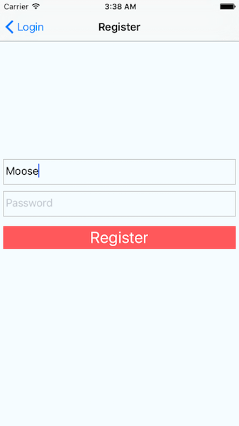
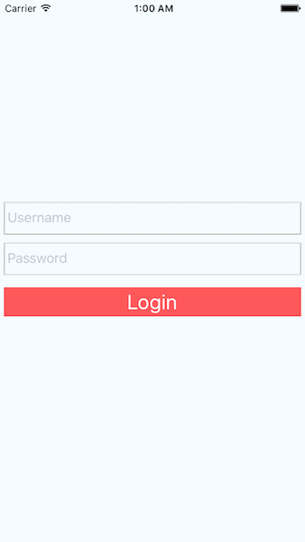
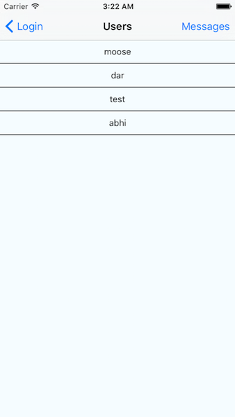
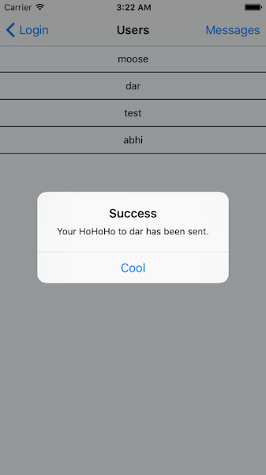
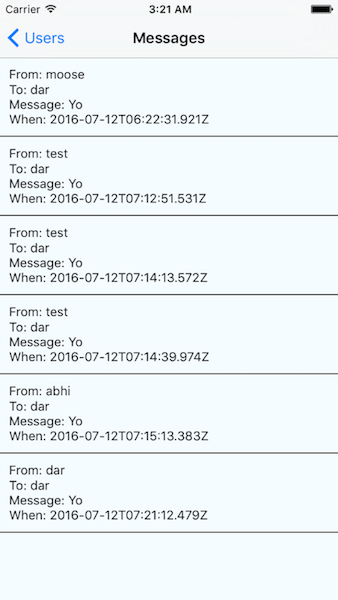

# Pair programming exercise: Ho! Ho! Ho!

## Goal

Your goal is to create a simplified clone of the [Yo
app](https://www.justyo.co/), a "contextual messenger" that lets you send a
simple "Yo" message to friends (if you haven't heard of Yo already, [read about
it
here](http://www.businessinsider.com/whats-happened-to-7-million-app-yo-now-that-the-hype-has-died-2014-9)).
You'll build this app using React Native and run it on the mobile platform of
your choice, iOS or Android.

Your app will have the following features:

- Register
- Login
- List all users
- Send a HoHoHo to users
- List messages sent and received
- (Bonus) Implement pull to refresh

## Instructions

If you haven't already, start by following the instructions in [today's warmup
exercise](../warmup.md) to install the required components for React Native.

This is going to be the first project where your frontend and backend code are
totally separate. Your frontend will be running on a mobile phone (or in a
mobile emulator), via React Native; your backend is hosted by us. Scroll all the
way to the bottom to find the **_Endpoint Reference_** for our API.

To start the frontend code in the iOS simulator, `cd` into the
`hohoho` directory in the terminal and run `react-native run-ios`.

## Part 1. Registration

### Overview

For registration, we will be creating a screen that _looks like_ the following:




Your registration screen should be able to _do_ the following:

- Take a username as an input
- Take a password as an input
- Make a `POST` request to a server (API reference provided, see **_Endpoint Reference_**).


### Creating Components - `index.ios.js [Register]`


Let's create the registration screen.

The first thing you'll notice is the boilerplate code for `NavigatorIOS` inside the
root component at the top of `index.ios.js`, which allows us to
move forward and backward among a series of screens in our app, for instance,
from a Login screen to a Main screen. Don't worry too much about this for now.
Just use the boilerplate code to build these two screens.

On the registration screen, use `TextInput` components for the form fields, with a
callback to pass the value to the state, like this:

```javascript
<TextInput
  style={{height: 40}}
  placeholder="Enter your username"
  onChangeText={(text) => this.setState({username: text})}
/>
```

You can find more information in [Handling text input](https://facebook.github.io/react-native/docs/handling-text-input.html).

You will need two of these `<TextInput />` components, once for maintaining a state for `username`, and another storing state for `password`. Both of these will be used upon submitting the registration!

Then you'll need a submit button. Use `TouchableOpacity` for this, with an
`onPress` handler. If you need an example for `TouchableOpacity`, take a look at the scaffolding for the `<Login />` component we provided for you. If you want to hide the user input (say, for passwords), add the prop: `secureTextEntry={true}`.

> **Tip:** We also created some preset styles, such as `styles.button` and `styles.buttonBlue` , `styles.buttonGreen`, and `styles.buttonRed`. Feel free to add your own in the `StyleSheet` at the bottom!

Once you've got and validated the input values, you can make an HTTP POST
request with the username and password to the backend route like this:

```javascript
fetch('https://hohoho-backend.herokuapp.com/register', {
  method: 'POST',
  body: JSON.stringify({
    username: 'theValueOfTheUsernameState',
    password: 'theValueOfThePasswordState',
  })
})
.then((response) => response.json())
.then((responseJson) => {
  /* do something with responseJson and go back to the Login view but
   * make sure to check for responseJson.success! */
})
.catch((err) => {
  /* do something if there was an error with fetching */
});
```

Instead of using `$.ajax()`, in React Native we use the `fetch` command to make
an HTTP request. The syntax is slightly different, since `fetch` returns a
promise. The `then` clause contains a success and an error handler. Read more
about this in [Networking](https://facebook.github.io/react-native/docs/network.html).

⚠️ **Warning:** Make sure to call `.then(response => response.json())` (like above) **before any other `.then` statements** to turn the raw response into JSON that you can process in subsequent `.then`'s.

Awesome! If you've gotten a successful response from the server, now it's time
to take the user to the next screen of the app. Inside your success promise
chain, call the `this.props.navigator.pop()` to use the `NavigatorIOS` component to bring us back to our previous view - the Login view. 

### End Result, Part 1

By the end of Part 1, make sure that you are able to access your registration view upon load of the app, enter in registration details (username and password), and successfully get a response back from the server. Upon successful registration, your app should bring you back to the Login view to login with the details you just registered with.

Congratulations! You've built your first native application view - in the next part, we'll build login in much the same way we did with registration, using `fetch` for handling network requests with our backend, and calling methods on our `NavigatorIOS` to bring us into different views. 

## Part 2. Login

### Overview

For login, we will be creating a view that looks like the following:



Your login view will be able to do the following:
- Take a username through a text input
- Take a password through a text input
- Use `fetch` to verify a user that is logging in with the above inputs
- Push a new view upon success, and display an error upon failed authentication

### Creating Components - `index.ios.js [Login]`

This view will be very similar to registration - we will only need to change the routes we use for `fetch` and change what happens upon success. 

Build two `<TextInput />` components and a `<TouchableOpacity />` component within the `render()` function of our `Login`, much the same as our `Register` component from the previous step. 

Create a new `onPress` handler for the `<TouchableOpacity />` component that will do the following:

- Calls `fetch` for requesting the login route and checking if the user's input matches a valid login.
  - Refer to the **_Endpoint Reference_** below for how to call our login route.
- If the `responseJson.success` is true, continue and push a new view - a view that displays all the users (we will create that next - for now, you can push the Register view again).
  - **Remember:** pushing the registration view will look like:
  ```javascript
  this.props.navigator.push({
    component: Register,
    title: "Register"
  })
  ```
  - **Careful - we will replace thie later!** In the next step, we will modify this function to push the `Users` component here rather than the Register view again. We will let you know when that needs to happen!
- If `responseJson.success` is not true, display a message with the error from the response. 
  - To display a message to the user, set a property to your state (with `setState`) and create a `<Text>` component like the following that updates with your state:
  ```jsx
  <Text>{{this.state.message}}</Text>
  ```

### End Result, Part 2
At the end of Part 2, you should be able to both register and login; successful logins will bring up the registration view again, but we will change this in the next part.

**Note that all new requests will now automatically be authenticated, thanks to cookies!** No need to store a username, password, or token for this simple app.

## Part 3. User list
### Overview

Now that we've successfully logged into our app, we will create a list view for displaying our users that we are able to send messages to. The result will look like the following:



Your users view will be able to do the following:

- `fetch` all users from the database
- Display the result of this `fetch` in a list view with all usernames of each user
- Upon tapping any of the displayed users, another `fetch` should be called to send a "HoHoHo" to the tapped user (from the user that is logged in)

We'll break this down into sections: first, we'll just handle displaying a list of users, and then, we'll use `fetch` to display the correct list of users.

### Creating Components - `index.ios.js [Users]`

The main screen of your app is going to contain a list of the user's friends;
tapping one of them would "Ho! Ho! Ho!" them. The easiest and most natural way
to display a list of data in React Native is by [Using a ListView](https://facebook.github.io/react-native/docs/using-a-listview.html).

Take a look at the top of your `index.ios.js` and spot a line that looks like:

```javascript
import {
  ...
  ListView
} from 'react-native'
```

This import statement allows us to use `ListView` throughout the rest of our app - we've done this for you!

Next, we need to add something called a _data source_ to the state for the
`Users` component. In React you learned to do this using the
`getInitialState` lifecycle method!
Use this knowledge to add your data source to your view upon `getInitialState`. For now
we'll make it contain a static list of friends:

```javascript
var Users = React.createClass({
  getInitialState() {
    const ds = new ListView.DataSource({rowHasChanged: (r1, r2) => r1 !== r2});
    return {
      dataStore: ds.cloneWithRows([
        'Moose', 'Lane', 'Josh', 'Ethan', 'Elon', 'Darwish', 'Abhi Fitness'
      ])
    };
  }
})
```

Let's render the list view. Inside the main `<View>` component in the `render`
method for this `Users` view, add a list view component like this:

```javascript
<ListView
  dataSource={this.state.dataSource}
  renderRow={(rowData) => <Text>{rowData}</Text>}
/>
```

Boom! Now we have a list of friends in our app. Kinda. Of course,
there's no data yet, so the list never changes and you can't add to it, but,
hey, if you're gonna have a static list of friends, that's a hell of a list!

### Checkpoint, Part 3
At this point, you should be able to register, login, and view a static list of users that currently do nothing. In the next section, we will fetch a list of users and add an `onPress` handler to send a _Ho Ho Ho!_ to any user we tap.

### Creating More Components - `index.ios.js [Users]`

Now, implement `fetch` inside of your `getInitialState` to load up an array of real users rather than a list of static users.

```javascript
.then((responseJson) => {
  return {
    dataStore: ds.cloneWithRows(/* replace this with the array 
                                      * of users you receive in 
                                      * the response of fetch! */)
  };
});
```

We will also need to modify your `render` function to handle our response correctly, since `responseJson` is now an array of _objects_. Change the `<Text>` component within each `renderRow` of your `<ListView />` to:

```jsx
<ListView
  ...
  renderRow={(rowData) => <Text>{rowData.username}</Text>}
/>
```

### End Result, Part 3

By Part 3, you will be able to login, register, and view all usernames returned by our backend. Tapping them will do nothing yet, but we will take care of that in the next part!

## Part 4. Send a HoHoHo



_Coming soon_

## Part 5. Messages list



_Coming soon_

## Bonus. Pull to refresh

_Coming soon_

Update your message and user views to be able to perform a
[pull to refresh](https://facebook.github.io/react-native/docs/refreshcontrol.html).


## Endpoint Reference - `https://hohoho-backend.herokuapp.com/`

**Base URL:** https://hohoho-backend.herokuapp.com/

All endpoints accept JSON data and return JSON data. All responses include
a boolean `success` field that indicates if request was successful.
You can also use the response status code to figure out if a request
was successful.

- `POST /register`: Register a new user. Does **not** automatically log user in.
  - Parameters:
    - `username`: Required String
    - `password`: Required String
  - Response codes:
    - `400`: Bad user input, includes `error` field indicating cause
    - `200`: Registration successful
- `POST /login`: Log in as a pre-existing user.
  - Parameters:
    - `username`: Required String
    - `password`: Required String
  - Response codes:
    - `400`: Bad user input, includes `error` field indicating cause
    - `401`: Bad username or password, includes `error` field indicating cause
    - `200`: Login successful
- `GET /login/success`: Check if the user is logged in
  - Parameters: **none**
  - Response codes:
    - `401`: User is not logged in
    - `200`: User is logged in
- `GET /users`: Get all registered users in HoHoHo
  - Example response:

  ```javascript
  {
    "success": true,
    "users": [
      {
        "username": "moose",
        "_id": "57844cbdbedf35366e2690d3"
      },
      {
        "username": "dar",
        "_id": "57846e7666b869d88ad96430"
      },
      {
        "username": "other",
        "_id": "57846fea0ccbba228cd1479e"
      },
      {
        "username": "other2",
        "_id": "57846ff00ccbba228cd1479f"
      }
    ]
  }
  ```

- `GET /messages`: Get messages sent to and from current user
  - Example response:

  ```javascript
  {
    "success": true,
    "messages": [
      {
        "_id": "57846f6cafacd3988b4362e6",
        "to": {
          "_id": "57846e7666b869d88ad96430",
          "username": "dar"
        },
        "from": {
          "_id": "57844cbdbedf35366e2690d3",
          "username": "moose"
        },
        "__v": 0,
        "body": "Yo",
        "timestamp": "2016-07-12T04:17:48.304Z"
      }
    ]
  }
  ```
