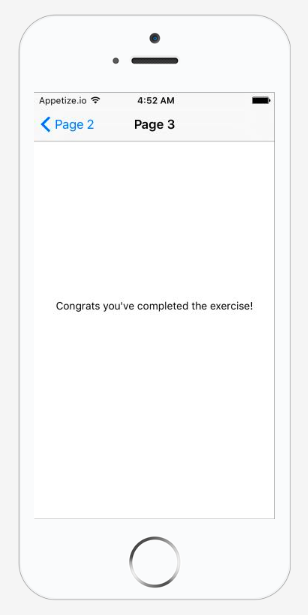

# Inline exercise: React Native Navigation
## Time limit: 15 minutes

## Goal

The goal of this exercise is to learn how to use the navigation elements in
React Native.

## Instructions

1. Open [Inline Exercise 2 in RNPlay][rnplay]
1. Complete the `next()` handler in the `Page1` component. When this
   handler is fired, take the user to Page 2 using `this.props.navigator`:

   ```javascript
   this.props.navigator.push({
     component: NEXT PAGE COMPONENT HERE,
     title: NEXT PAGE TITLE HERE
   });
   ```

1. Complete the `next()` handler in `Page2` as well.
1. When you're on Page 3 you should see

  

1. Use the buttons on the upper left corner to navigate back to Page 1.
   Go back and forth a couple times. Nifty!
1. If you're done early, add a button to the upper right hand corner
   by passing in the `rightButtonTitle` and `onRightButtonPress` properties
   to `this.props.navigator.push()`.
   [More info.](https://facebook.github.io/react-native/docs/navigatorios.html)

[rnplay]: https://rnplay.org/apps/lAQzXw
