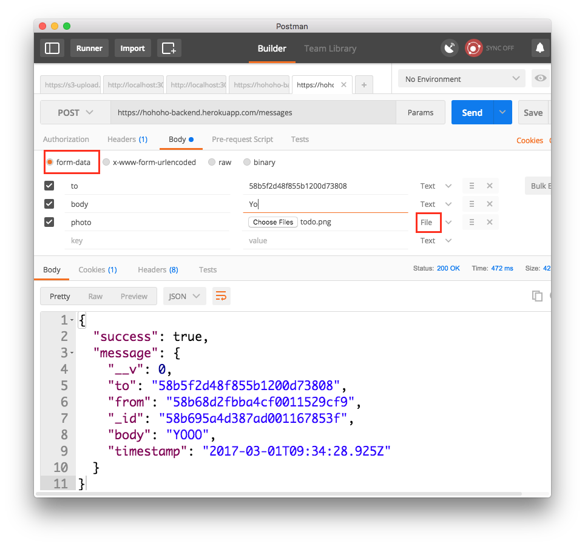

# Pair programming exercise: Ho! Ho! Ho! (Part Deux)

## Goal

Your goal is to extend the [Ho! Ho! Ho! project from yesterday](../day1/hohoho)
to add a final set of features:

- After the user logs in, always check for new messages and update the display
  when new ones arrive
- Display photos included in your messages
- Ability to send photos along with your messages

## Instructions

The instructions for these exercises are short and sweet to give you a chance
to practice looking through documentation.

### Exercise 1. Always check new messages

Use `setInterval` in your `Messages` component to periodically make `fetch`
requests to the appropriate endpoint and show messages.

When new messages show up in the response, display them on the screen with a
yellow background to draw the user's attention.

### Exercise 2. Display photos stored in your messages

Message objects in the `GET /messages` response now include an **optional** URL for
a photo. If a message has an attached photo, display it below the map using
[Images in React Native](https://facebook.github.io/react-native/docs/images.html).

You can test this functionality by uploading photos using Postman.
You'll need to make a `POST` request to `https://hohoho-backend.herokuapp.com/messages`
using `form-data` for the body and an image file included as the `photo` parameter.
Don't forget to first log in while using Postman.




### Exercise 3. Upload photos on long press

Update your `longPress` handler in the `Users` component to get prompt the user
to pick an image from their camera roll. When the user picks an image upload
it along with the message under the `photo` parameter.

⚠️ When uploading files with `fetch()` set the `Content-Type` header
to `multipart/form-data`. ⚠️

These links will be useful on your quest:

- [Enabling camera roll image picker](https://goshakkk.name/react-native-camera-roll-image-picker/)
- [Uploading photos with React Native](http://doochik.com/2015/11/27/FormData-in-React-Native.html)

## Endpoint Reference - `https://hohoho-backend.herokuapp.com/`

The backend endpoints are the same except they now support a new feature:
upload and view images.

**Base URL:** https://hohoho-backend.herokuapp.com/

- `GET /messages`: Get messages sent to and from current user
  - 🌟 New optional field: `photo` public URL for a photo associated with a message 🌟
  - Example response:

  ```javascript
  {
    "success": true,
    "messages": [
      {
        "_id": "57846f6cafacd3988b4362e6",
        "to": {
          "_id": "57846e7666b869d88ad96430",
          "username": "dar"
        },
        "from": {
          "_id": "57844cbdbedf35366e2690d3",
          "username": "moose"
        },
        "photo": "https://horizons-demo.s3.amazonaws.com/some-image-url-here",
        "__v": 0,
        "body": "Yo",
        "timestamp": "2016-07-12T04:17:48.304Z"
      }
    ]
  }
  ```

- `POST /messages`: Sends a message/_Ho Ho Ho!_ to another user
  - 🌟 Now also supports `Content-Type: 'multipart/form-data'` when uploading
    files 🌟
  - Parameters:
    - `to`: the ID of the user you are sending a message to
    - 🌟 `photo`: (_Optional_) a photo file to send with the message 🌟
    - `location`: (_Optional_) - an Object that represents a sent location in a _Ho Ho Ho!_
      - `latitude`: The latitude of the location
      - `longitude`: The longitude of the location
  - Response codes:
    - `401`: User is not logged in
    - `400`: There was an error saving to database
    - `200`: The _Ho Ho Ho!_ was sent!
  - Example response:
  ```javascript
  {
    "success": true,
    "message": {
    "__v": 0,
    "to": "57849dac19a9131100ab2fe5",
    "from": "578533b8787e661100aec76a",
    "_id": "5785397a787e661100aec7d6",
    "body": "HoHoHo",
    "timestamp": "2016-07-12T18:39:54.406Z"
    }
  }
  ```

## Suggested reading
- [Enabling camera roll image picker](https://goshakkk.name/react-native-camera-roll-image-picker/)
- [Uploading photos with React Native](http://doochik.com/2015/11/27/FormData-in-React-Native.html)
- [Images in React Native](https://facebook.github.io/react-native/docs/images.html)
