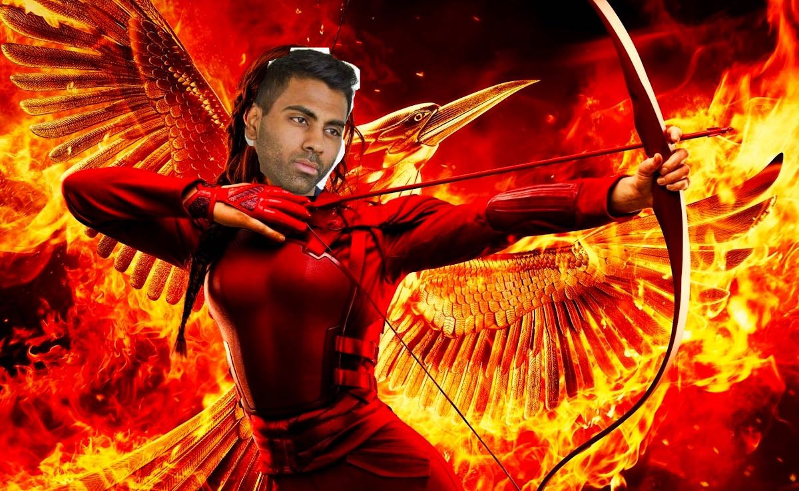

## The Horizon Games!

##### *may the odds be ever in your favour*

 
Thursday/Friday for this week will be spent creating a mobile turn based multiplayer game in React Native for iOS. This announcement includes an overall game-plan for tackling the next two days, and outlines what is required in your final product.

### what to build & judging

You should be building a full stack **multiplayer** game (we *suggest* implementing an existing card based game like Cards Against Humanity)

All teams will demo their games on Monday morning to the whole class. Winners will be determined by your votes. Your vote should be based on the following criteria:
1. What works best? (fewest bugs)
1. What is the most fun to play?
1. Which game requires the most technical work?

*note that you can not vote for your own team even though it is the best one*

**REQUIRED**: Your game **must** be multiplayer & **must** include a backend hosted on heroku or gomix.

### schedule/game-plan
1. you will be placed into groups of three or four
1. brainstorm & decide on what to build
1. draw up a proposal w/
  - MongoDB models and fields (i.e. schema design)
  - team work assignments (how will work be distributed amongst team members)
  - rules of the game (we recommend you build a turn based card game)
  - components you will use to build your app *[OPTIONAL]*
1. **PROPOSALS DUE THURSDAY @11:00 a.m. SHARP** -- *work on them Wednesday night/Thursday morning*
  - we will review proposals and make sure they:
    - meet requirements
    - are practical
    - are at the right amount of difficulty
  - we may add suggestions/recommendations to further improve your ideas
1. react to the proposal review & make changes if necessary
1. begin work Thursday afternoon
1. *soft end* work Friday night (you are allowed to continue work into the weekend)
1. demo your game Monday morning
1. vote and announce winners Monday afternoon

### prizes
the winning team will be granted a romantic dinner with this man

